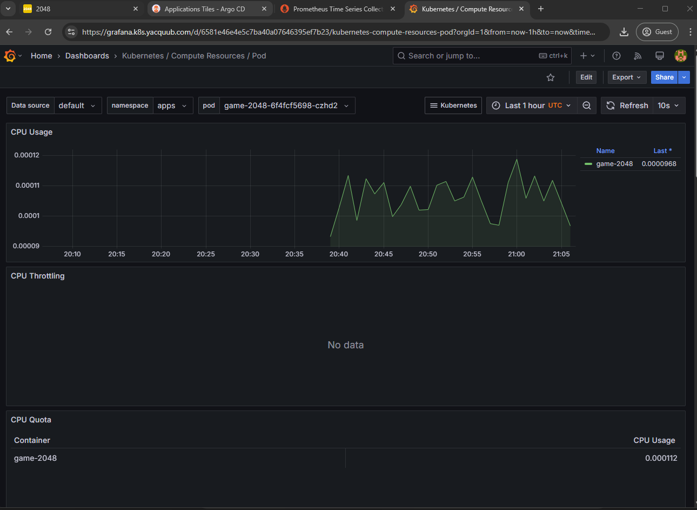

## Overview

► README for deploying **Kube2048**, a production-grade Kubernetes-based 2048 game, to AWS EKS using Terraform and Helm. The deployment includes Argo CD for GitOps, NGINX Ingress for traffic management, Cert-Manager for SSL, and ExternalDNS for dynamic DNS management. CI/CD is handled via GitHub Actions, with Prometheus & Grafana for monitoring.

---

# Kube2048


# Monitoring



# Local app setup 💻
```bash
yarn install
yarn build
yarn global add serve
serve -s build

#yarn start
http://localhost:3000/workspaces/default/dashboard

## or
yarn global add serve
serve -s build
```

# Prerequisites

- AWS CLI
- kubectl
- Terraform
- Helm
- Docker

# Multi-Stage Docker Build

Used **multi-stage Docker build**, to follow the best practices for image size and security.

# 📂 Terraform

To ensure modularity and **code reusability** (DRY principle), I’ve structured Terraform using separate modules for each infrastructure component:

1. **VPC Module**
   - Used a custom VPC setup making use of community modules. private subnet nat gateway public subnet

2. **EKS Module**
   - Creates an Amazon EKS cluster, node groups, and associated IAM roles based on the custom vpc setup.
  
3. **IRSA Module**
   - set up IAM Roles for Service Accounts in an Amazon EKS cluster to securely assume AWS IAM roles granting them access to AWS resources.

4. **Helm Module**
   - Configures the **NGINX Ingress Controller** to route traffic to services, **Cert-Manager** for automatic certificate management, **ExternalDNS** to dynamically create DNS records,**ArgoCD** for continuous deployment and GitOps workflows, **Kube-Prometheus-Stack** for monitoring and observability.

**Additional Files**

   - The `backend.tf` file is used to store Terraform state in **S3** with **DynamoDB** for state locking, preventing conflicts during deployments.

   - The `provider.tf` file configures the AWS provider to interact with an EKS cluster and the Helm provider to manage Helm charts on the cluster. It uses the EKS cluster endpoint and authentication token from AWS CLI for secure Kubernetes access.

   - The `locals.tf` file defines local variables used throughout the Terraform configuration ensuring consistency and ease of reference.


# 🚀 Deployment Workflow

The **Kube2048** app is managed through **GitHub Actions** pipelines, automating the deployment lifecycle:

1. **ECR Push Pipeline**
   - Builds and pushes the Docker image to **Amazon Elastic Container Registry (ECR)**.

2. **Terraform, Kubernetes Deploy Pipeline**
   - Automates AWS infra deployment using Terraform followed by Kubernetes resource deployment. It runs static analysis (linting, security), creates a Terraform plan, applies the changes, and deploys the necessary resources to the EKS cluster.

3. **Terraform Destroy Pipeline**
   - Destroys the infrastructure to prevent unnecessary costs.

This setup ensures a **production-grade** Kubernetes deployment of **Kube2048** with best practices for **security, scalability, and maintainability**.


